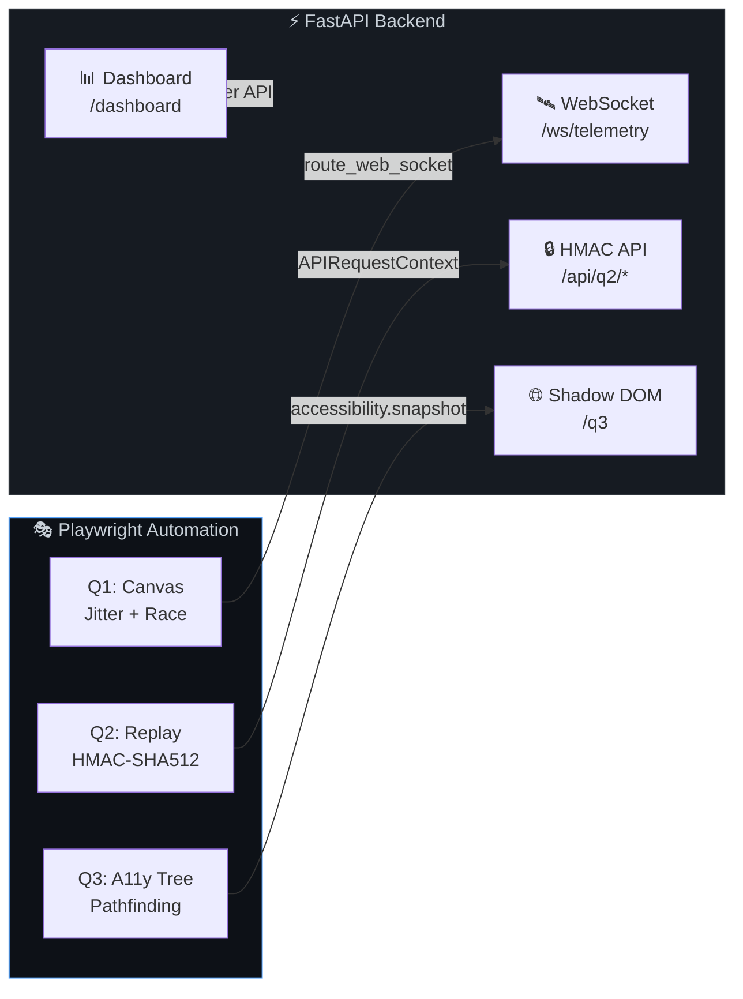

<div align="center">

<!-- Animated Header Banner -->


<!-- Animated Typing Effect -->
<a href="#">
  
</a>

<br/>

<!-- Tech Stack Badges -->


<br/><br/>

<!-- Status Badges -->


</div>

<br/>

---

<br/>

## 🏗️ Architecture Overview



<br/>

## 📋 Module Breakdown

<table>
<tr>
<td width="33%" valign="top">

### 🎯 Q1 — Canvas & WebSocket

**Dynamic HTML5 Canvas State Drifts & Asynchronous Race Interceptions**

- WebSocket stream interception via `page.route_web_socket`
- Fibonacci jitter injection (capped at 8000ms)
- Frame #5 payload corruption (`balance → "1e+7"`)
- `requestAnimationFrame` pixel-color scanning
- Hover → Drag 15px → Click macro in 30–100ms
- Exception boundary validation

</td>
<td width="33%" valign="top">

### 🔐 Q2 — Cryptographic Replay

**Stateful Nonces & Hash-Chain API Chaining**

- Server-issued nonce, salt, and microsecond timestamp
- HMAC-SHA512 signature generation
- Transaction mutation via signed PUT request
- Duplicate replay fired within < 150ms
- `409 Conflict` rejection assertion
- `HIGH_RISK_DATA_MUTATION_REPLAY_ATTEMPT` validation

</td>
<td width="33%" valign="top">

### 🌐 Q3 — Shadow DOM A11y

**Sealed Closed-Boundary Pathfinding & Accessibility Tree Refactoring**

- Nested open + closed Shadow DOM traversal
- Accessibility-tree-only element targeting
- CoT system prompt artifact
- Forbids IDs, XPaths, CSS selectors
- Role-path + ARIA state navigation
- `page.accessibility.snapshot()` validation

</td>
</tr>
</table>

<br/>

## 🚀 Quick Start

### Prerequisites

```
Python 3.12+  •  pip  •  Google Chrome or Microsoft Edge
```

### Installation

```bash
# 1. Clone or navigate to the project
cd "frugal testing"

# 2. Install dependencies
pip install -r requirements.txt

# 3. Install Playwright browsers
python -m playwright install chromium
```

### Run All Tests

```bash
python -m pytest -q
```

**Expected Output:**
```
4 passed, 2 skipped, 4 warnings in ~44s
```

> **Note:** The 2 skipped tests are Cloud Command smoke tests that require `RUN_CLOUD_COMMAND_SMOKE=1`.

### Launch Dashboard

```bash
python -m uvicorn app.main:app --host 127.0.0.1 --port 8010
```

Then open → **http://127.0.0.1:8010/dashboard**

<br/>

## 📁 Project Structure

```
frugal-testing/
│
├── app/
│   ├── __init__.py              # Package init
│   ├── constants.py             # Shared constants & configuration
│   ├── main.py                  # FastAPI server, WebSocket, HMAC API, HTML pages
│   └── runner.py                # Playwright automation runner modules
│
├── tests/
│   ├── conftest.py              # Pytest fixtures, server launcher, browser config
│   ├── test_q1_canvas_websocket.py      # Q1: Canvas jitter & race interception
│   ├── test_q2_replay_api.py            # Q2: HMAC replay protection
│   ├── test_q3_shadow_dom_accessibility.py  # Q3: Shadow DOM accessibility
│   ├── test_runner_api.py               # Runner API integration test
│   └── test_cloud_command_smoke.py      # Optional: Cloud Command smoke test
│
├── artifacts/
│   └── q3_accessibility_prompt.md   # CoT system prompt for A11y pathfinding
│
├── frontend/
│   ├── code.html                # Stitch-generated automation dashboard
│   ├── DESIGN.md                # Dashboard design specification
│   └── screen.png               # Dashboard screenshot
│
├── requirements.txt             # Python dependencies
└── README.md                    # You are here
```

<br/>

## ⚙️ Technical Deep Dives

<details>
<summary><b>🎯 Q1 — WebSocket Jitter & Canvas Race Detection</b></summary>

<br/>

**Server Side:** FastAPI serves a WebSocket endpoint (`/ws/telemetry`) broadcasting sequential JSON frames containing coordinates, status, color, and balance values at 80ms intervals.

**Client Side:** HTML5 Canvas renders telemetry data with a `requestAnimationFrame` pixel scanner that detects color transitions from gray (loading) to active states.

**Playwright Interception:**
```python
def route_socket(ws):
    server = ws.connect_to_server()
    fib = [1, 1, 2, 3, 5, 8]

    def on_server_message(message):
        frame = json.loads(message)
        delay_ms = min(1000 * fib[min(idx, len(fib) - 1)], 8000)

        if frame["seq"] == 5:
            frame["balance"] = "1e+7"  # Corrupt payload

        time.sleep(delay_ms / 1000)
        ws.send(json.dumps(frame))
```

**Validation:** Asserts exception boundary `[data-testid="exception-boundary"]` is rendered and action chain completes within 30–100ms.

</details>

<details>
<summary><b>🔐 Q2 — HMAC-SHA512 Replay Protection</b></summary>

<br/>

**Signature Formula:**
```
material = body + "." + timestamp_us + "." + salt_sequence + "." + nonce
signature = HMAC-SHA512(shared_secret, material)
```

**Test Flow:**
1. `POST /api/q2/transactions` → Extract nonce, salt, timestamp headers
2. Build HMAC-SHA512 signature over the mutation payload
3. `PUT /api/q2/transactions/{id}` → First request succeeds (200)
4. Replay the identical PUT within < 150ms → Server returns `409 Conflict`

**Timing Measurement:**
```python
t0 = time.perf_counter()
replay = api.put(url, data=raw_body, headers=headers)
elapsed_ms = (time.perf_counter() - t0) * 1000
assert elapsed_ms < 150
assert replay.status == 409
```

</details>

<details>
<summary><b>🌐 Q3 — Shadow DOM Accessibility Pathfinding</b></summary>

<br/>

**Challenge:** Locate interactive elements inside nested open/closed Shadow DOMs without using any syntactic DOM selectors.

**Approach:** Uses the browser's computed OS Accessibility Tree via `page.accessibility.snapshot()` and role-based locators (`page.get_by_role()`) which natively pierce shadow boundaries.

**CoT Prompt Rules:**
- ❌ No element IDs
- ❌ No CSS selectors or class names
- ❌ No XPaths
- ❌ No raw text matching
- ✅ Role hierarchy paths only
- ✅ ARIA state filters
- ✅ Geometric neighbor constraints

</details>

<br/>

## 🔧 Environment Configuration

| Variable | Default | Purpose |
|:---|:---|:---|
| `FRUGAL_SHARED_SECRET` | `frugal-testing-local-secret` | HMAC-SHA512 signing key |
| `RUN_CLOUD_COMMAND_SMOKE` | `0` | Set to `1` to enable cloud smoke tests |
| `CLOUD_COMMAND_URL` | — | Frontend deployment URL |
| `CLOUD_COMMAND_API_URL` | `https://cloud-command.onrender.com` | Backend deployment URL |

<br/>

## 🎥 Video Walkthrough Checklist

- [ ] Terminal output from `python -m pytest -q` showing all tests passing
- [ ] Source code walkthrough of key files
- [ ] GenAI prompt/history window used during development
- [ ] Dashboard execution at `http://127.0.0.1:8010/dashboard`

<br/>

## 🛠️ Tech Stack

<div align="center">

| Layer | Technology | Role |
|:---:|:---:|:---|
| 🖥️ | **FastAPI** | HTTP/WebSocket server, API routing, HTML page serving |
| 🎭 | **Playwright** | Browser automation, WebSocket interception, API testing |
| 🧪 | **Pytest** | Test orchestration and assertion framework |
| 🔐 | **HMAC-SHA512** | Cryptographic signature generation and replay detection |
| 🌐 | **Shadow DOM** | Closed-boundary web component accessibility testing |
| 📊 | **Stitch** | Dashboard UI generation and design system |

</div>

<br/>

---

<div align="center">


<br/>

**Built with 🧪 precision for the Frugal Testing AI-Native Internship**


</div>
